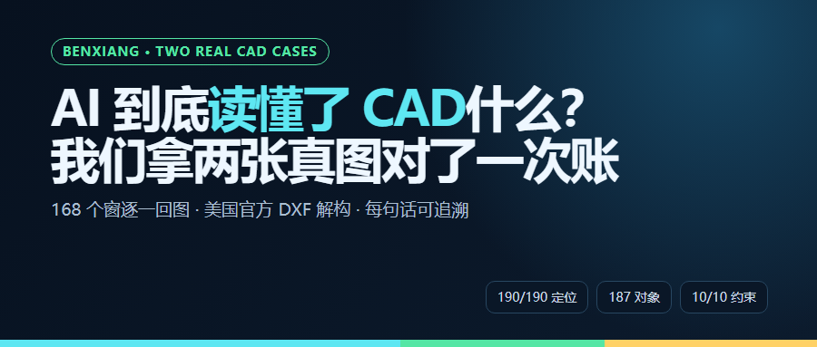
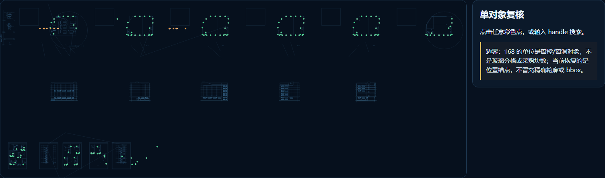
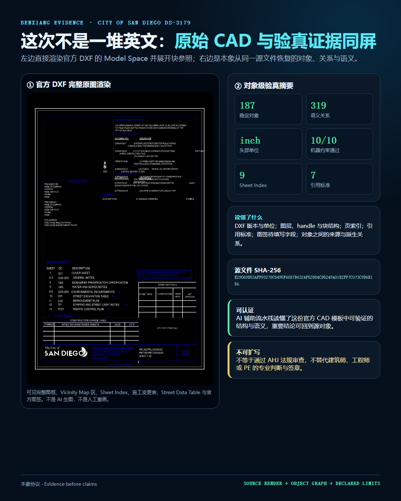
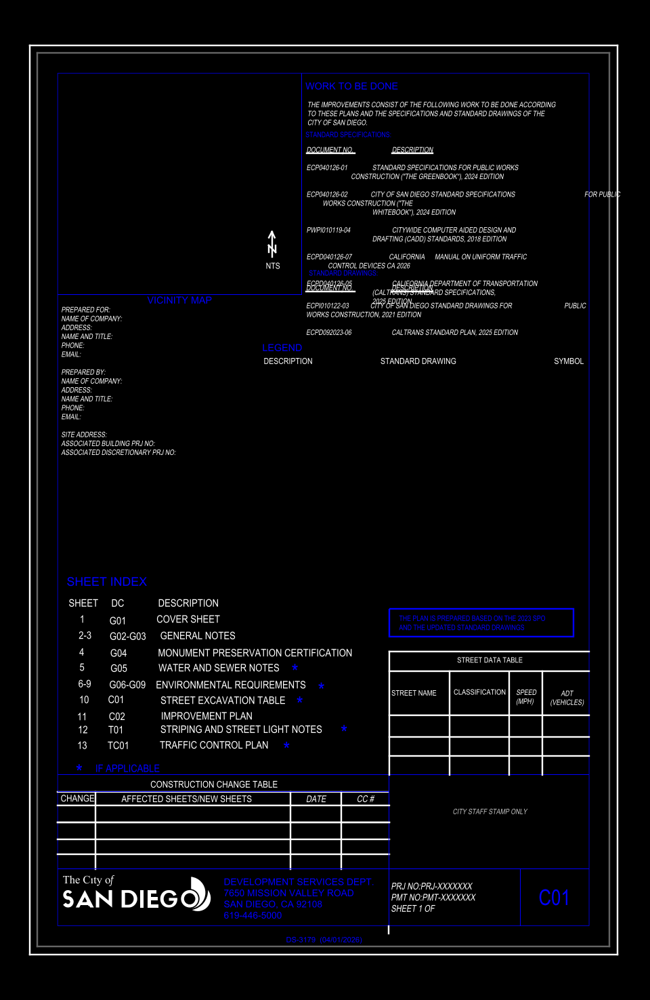
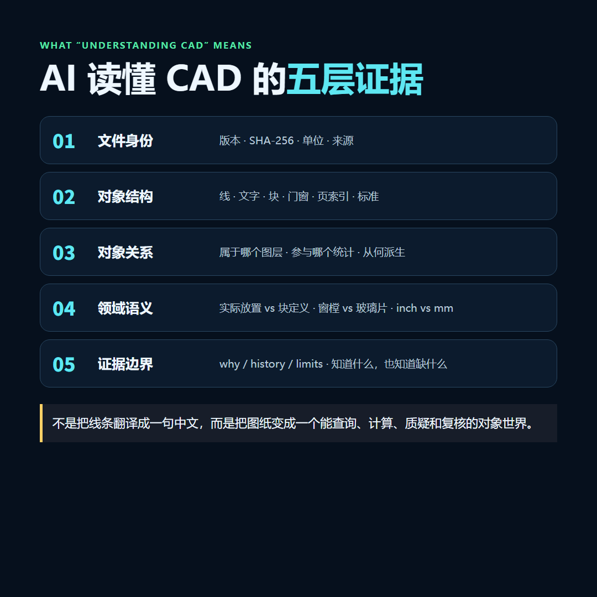

# 普通 AI 数出 7 个窗，我们交付了 168 个可复核对象

> 我们开始承接国内外 CAD 图纸的 AI 统计、核对、规则预检和修订审查。先不讲“颠覆审图”，就拿两张真图说话：复杂 DWG 的 168 个窗能逐一回图，美国官方 DXF 的图框、页索引、标准和待填字段能形成对象证据。

## 一个数字，把两种 CAD AI 分开了

`7 / 5`，这是普通多模态 AI 看一张脱敏总览截图后，给出的窗和门数量。

`168 / 22`，这是对象级流程读取受控原始 DWG 后，得到的窗和门数量。更关键的是：190 个实际放置对象，`190/190` 都恢复了位置锚点。

我又追问了一句：“第 97 个窗在哪里？”截图模型答不上来。它说得很诚实——图片里没有实体 ID、坐标系统和 CAD 属性，要回答这个问题，必须读取原始 DWG/DXF。

这事儿一下说透了。

==普通 AI 看的是图；真正的 CAD 审计，要读原件、识别对象、保留证据。==



先把比较口径说清楚：这不是模型排行榜。左边只拿到脱敏 PNG，右边在客户授权环境里读取原始 CAD。输入不同，恰好说明问题——总览截图导出的那一刻，handle、图层、块归属和代理载荷已经丢了。

===

## 我们不是把 7 猜成了 168

受控原始 DWG 里，离线流程识别出 `194` 个 `TCH_OPENING`：

```text
194 = 4 个块定义模板 + 190 个实际放置对象
190 = 168 个窗 + 22 个门 + 0 个未分类
```

如果交付物只有一行 `windows=168`，说实话，我也不敢拿它去接工程项目。客户只要问一句“你是不是多算了一樘”，项目就得从头来一遍。

所以我们保留的不是一个总数，而是 `opening:38A`、`opening:38B` 这样一批独立对象。每个对象带稳定 handle、分类依据、载荷指纹和位置证据。



客户质疑某一樘窗，可以直接查它：

```bash
origin why cases/cad-window-audit.origin \
  opening:38A.position_anchor
```

返回内容包括坐标、写入事务、解码器和 basis。**168 不再是一句回答，而是 168 个分别能找到、能查询、能复核的对象。**


这也是我们和常见“上传截图问 AI”的硬差异：

> 截图式 AI 给答案；对象级审计交对象。答案可以复制，对象可以继续查。

但边界不能藏。当前案例里的 168 指窗樘/窗洞对象，不是玻璃片；GNU LibreDWG 独立确认的是候选总数 194，不是 168/22 的分类；精确轮廓、朝向和 bbox 仍待恢复。

这些话不讨巧，却应该写进交付包。审图项目最怕的不是“有局限”，而是局限只在开发者脑子里。

===

## 第二张真图：美国官方 DXF，我们到底读懂了什么

第二个案例来自 ++[City of San Diego 官方页面](https://www.sandiego.gov/development-services/forms-publications/design-guidelines-templates)++ 的 `DS-3179 Construction Plan` DXF 模板，不是我们为了演示手搓的图。

源文件 SHA-256：

```text
E29069D53AFF93278C5495F60D7B6324F52884CD5249A01B2FF7C073C9D6E1BA
```

导入后得到 `187` 个本象对象、`319` 条关系，DXF 版本为 `AC1032`，头部单位为 `inch`。机器约束跑了 `10/10`。



上一版图片曾经翻车：投影器没有展开 DXF 块参照，又把多行 CAD 文字按单行 SVG 铺开，最后看上去只剩重叠英文。我看到截图时也觉得不对，回头查源文件，才确认是渲染层的问题。

现在这张图左侧直接渲染源 DXF 的 Model Space。完整图框、Vicinity Map 区、Sheet Index、施工变更表、Street Data Table 和圣迭戈官方图签都能看到；右侧才是对象、关系、语义和边界。



这张美国模板没有窗可数。它测试的是另一组能力：

- 文件版本和英制单位能否正确识别；
- Sheet Index 的页码、专业码和标题能否拆成对象；
- `Greenbook 2024`、`Whitebook 2024`、`California MUTCD 2026` 等引用能否回到源文字；
- `NAME OF COMPANY`、`SITE ADDRESS`、`PHONE`、`EMAIL` 等待填写字段能否被发现；
- “已读懂模板结构”这句话能不能反查依据。

这才是我们所说的 ++让 AI 读懂 CAD++：不是把英文识别出来，而是把文件变成一个可以继续查询、计算、质疑和复核的对象世界。

===

## 你手上的图纸，哪些任务可以先做

我们现在承接的不是“一键替你审完所有图”。这种话听着痛快，验收时通常一团糟。

更适合的是一个边界明确的问题：

- **数量统计与回图**：门窗、设备、构件、符号或指定块到底有多少，分别在哪里；
- **表图一致性**：平面图、门窗表、设备表、编号与说明有没有漏项、重复或冲突；
- **图纸完整性检查**：图层、命名、单位、图签、页索引、待填字段是否符合约定；
- **版本差异审查**：两版图纸新增、删除、移动、改类了哪些对象，哪些统计需要重算；
- **规则预检**：把业主标准、企业制图标准或具体辖区规则做成机器可跑的检查项；
- **隐私与本地处理**：原图不外传，在授权电脑内分析，只交脱敏投影和证据包。



国内项目可以做，海外 DXF 也可以做。DWG、DXF、复杂块、图层、代理对象能否读取，要看原图实际情况；拿一张样图跑，比在电话里承诺靠谱。

!!美国或其他海外项目的规则预检，不等于政府 AHJ 批准，也不替代建筑师、工程师或 PE 的专业判断与签章。!!我们能做的是把问题、对象证据和规则版本整理清楚，让有责任的人更快复核。

===

## 客户最后会拿到什么

我不希望项目做完只剩一份 PDF，更不希望只剩聊天记录。按任务范围，交付通常包括：

- 源文件身份、版本与 SHA-256；
- 对象清单、分类结果和稳定 ID；
- 对象位置、回图截图与可查询证据；
- 问题清单、统计表和机器判据；
- 结果的来源、派生历史与复核说明；
- 未覆盖项、剩余风险和需要专业人员判断的边界；
- 可选 HTML、PDF、CSV、JSON 与 `.origin` 证据包。

&&结果有问题，可以定位到对象；图纸换版，旧结论不会悄悄冒充新结论。&&

这就是本象协议在项目里的位置。ODA、LibreDWG、DXF 解析器和大模型负责读取、分析、转换；本象负责让这些工作留下身份、对象、关系、历史和边界。它不和模型抢功劳，它管的是模型干完活以后，客户还能不能查账。

===

## 合作方式：先拿一张图，做一个能验收的小问题

如果你手上有国内或海外 CAD/DWG/DXF 图纸，先准备一张有代表性的样图，再告诉我们三件事：

1. 你最想查什么？
2. 最终由谁复核、怎样算通过？
3. 哪些文字、图签或文件绝对不能外传？

我们先做小样。交一份对象清单、回图证据、问题样例、规则口径和能力边界。**有用，再扩到整套图集；不适合，也会尽早说清楚。**

项目可以是门窗统计，也可以是设备清单、图签检查、版本对比、规则预检或其他 CAD AI 任务。你不需要先懂本象协议，只需要带着一个真实问题来。

### 联系我们

- 微信：`hecare888`
- 邮箱：`hefangsheng@gmail.com`
- 案例与工具入口：[u-king.org](https://u-king.org)

作者团队还提供 ++U-King 多 AI 安装与使用工具++，可一键安装和使用 Claude Code、Codex、Hermes。

> 能看图，不等于能审图。能报一个数，不等于能交付。我们想接的，是那些最后必须说清“对象是谁、依据在哪”的 CAD 项目。

案例证据状态：2026-08-13。输入已验证：受控复杂 DWG、City of San Diego 官方 DXF。由于尚未完成同图、同范围、同验收标准的人工作业盲测，本文不宣称“效率提高 10 倍”。
