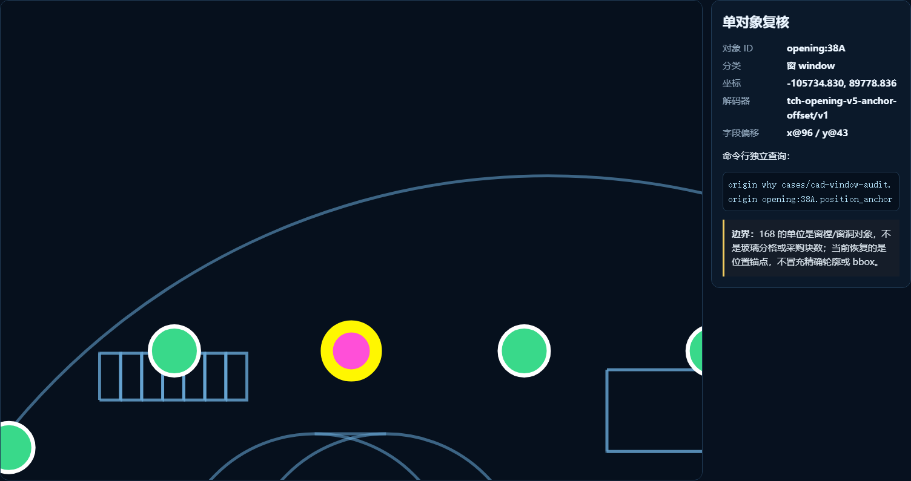
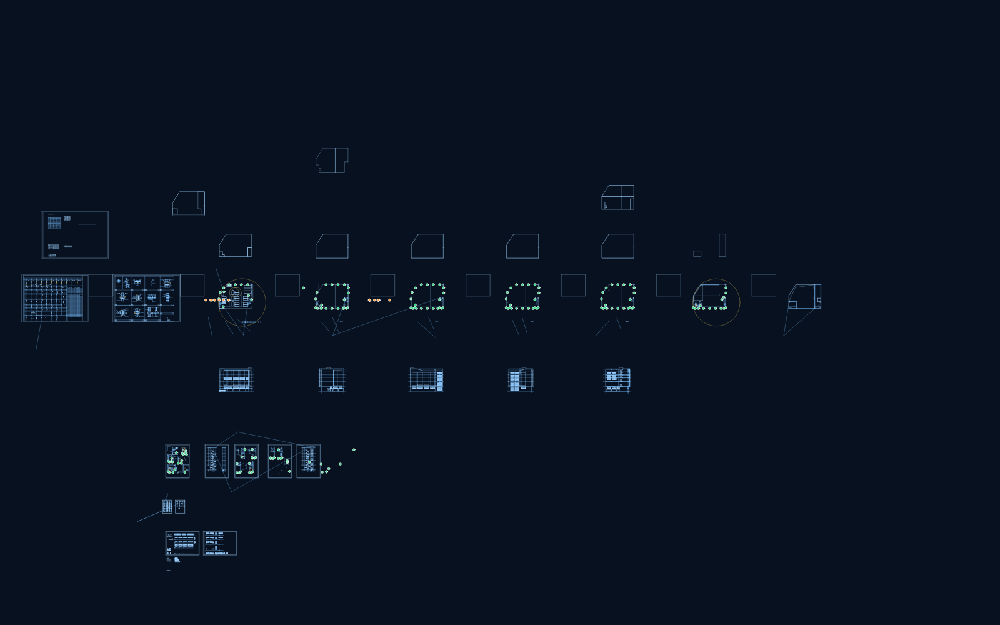
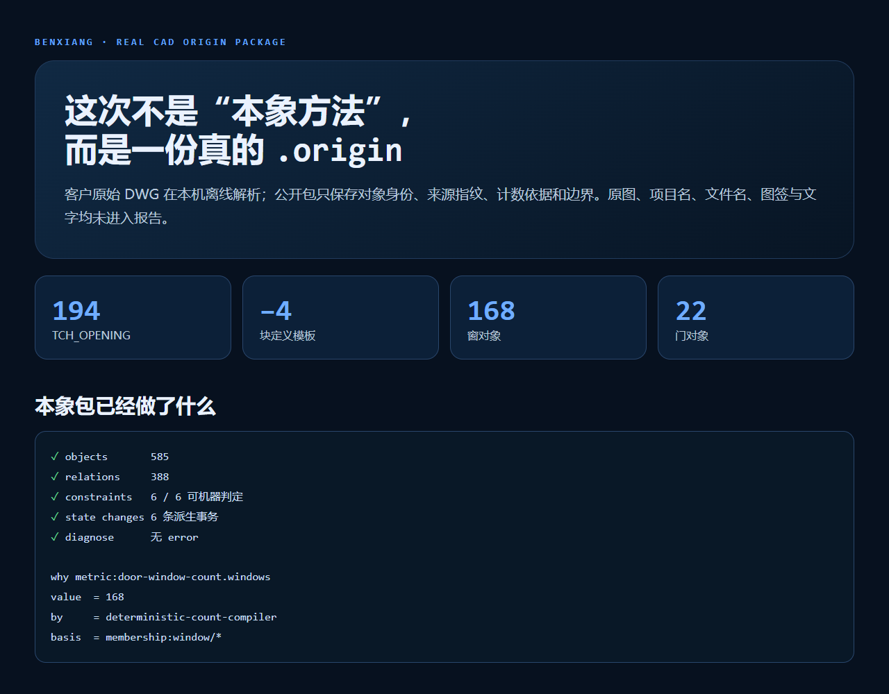

# AI 数出 168 个窗以后，我们追问：第 97 个在哪？

> 一张 6.58 MB 的复杂 CAD，机器报出“168 个窗”并不难。难的是：168 个对象能不能逐个点回原图，能不能解释为什么算它，能不能在换模型之后仍然复核。

日志里有一行很短：

```text
windows=168, doors=22, unknown=0
```

如果这是普通 AI 演示，差不多可以收工了。数字够醒目，截图也能做。

但我盯着它看了一会儿，觉得不对。**第 97 个窗在哪里？**它为什么算窗，不算门？如果客户说“你多算了一个”，我们拿什么回去对？

这三个问题，把一个计数小活变成了本象协议的实战测试。


## “168”不是答案，只是一个投影

这份图里，离线解析拿到了 194 个 `TCH_OPENING`。其中 4 个只存在于块定义，像模板，不是现场实际放置的门窗；剩下 190 个对象里，168 个被分类为窗，22 个为门，未知项是 0。

数字关系很干净：

```text
194 = 4 + 190
190 = 168 + 22 + 0
```

我第一次跑到这里，其实挺满意。过了几分钟又把这个结论降级了：==计数正确，不等于结果可审计。==

传统脚本会把 168 写进报表。大模型会把 168 组织成一句更像人的话。两者都可能没保留“这 168 个到底是谁”。一旦中间对象丢了，后续就只能重跑，或者相信那行日志。

本象这次保存的不是一行数字，而是一组对象：

```text
opening:38A
opening:38B
opening:38E
...
```

每个对象保留稳定 handle、所属图层、owner、分类、载荷 SHA-256，以及它参与哪些统计集合。168 只是 `membership:window/*` 的一个确定性投影。

这差别看起来像工程洁癖。真遇到争议时，它就是能不能把账对回去的差别。

## 最麻烦的地方：原图没有替我们缓存轮廓

我原先以为位置回落会很省事。`ezdxf` 能读取 `ACAD_PROXY_ENTITY` 的 proxy graphic，理论上直接取 virtual entities，再算 bbox 就行。

结果 194 个对象都有 proxy graphic，长度却清一色只有 8 字节。空的。

这破玩意很诚实：图里保留了天正对象的数据，但没有留下可直接展开的代理图形缓存。没有匹配的天正解释器，就不能假装已经拿到精确轮廓。

所以我们换了一个更保守的目标——**先恢复对象的位置锚点，不冒充 bbox。**

载荷里存在重复、稳定的 double 字段。窗对象的一个坐标只落在绝对偏移 41、43、47 三个版本位；另一坐标位于载荷后段。三组覆盖数是 `11 + 135 + 22 = 168`。门对象对应两组版本位，覆盖 `3 + 19 = 22`。

我不愿意只凭“数字正好对上”就发证。于是又做了两层闸门：每个对象必须只有一个无歧义坐标解；整批结果必须叠回脱敏基础几何，由图形分布做人工复核。只要出现一个歧义，导入器就拒绝生成可复核版 `.origin`。

最终结果是：&&190/190 个实际放置对象都有位置锚点&&。



上图里的 `opening:38A` 不是演示时临时编的编号。它能单独查询：

```bash
origin why cases/cad-window-audit.origin opening:38A.position_anchor
```

返回的不只有坐标，还能看到哪次事务写入、谁写的、依据哪些字段。这里写入者是 `tch-opening-anchor-decoder`，basis 指向该对象的载荷指纹、字段偏移证据和解码器观察。

这才算“落回去”。

## 到底是谁在干活：ODA、大模型，还是本象？

这个问题我觉得必须说清楚，不然宣传很容易写飘。

++ODA File Converter 27.1++ 负责把 DWG 转成可继续处理的 DXF；`ezdxf` 抽取代理对象；++GNU LibreDWG 0.14++ 从另一条链确认 class 528 总数确实是 194。它只独立确认总数，没有独立确认 168/22 分类——这条边界已经写进包里。

大模型干的活也不少：它分析二进制重复模式、写解码器、生成测试、检查叠加效果。我把它看成一个速度很快、但必须被约束的工程协作者。

那本象干什么？

> 本象不抢解析器和模型的功劳。它负责让这些功劳留下可复核的形状。

具体说，是四件事：

- 对象不丢：168 个窗仍然是 168 个独立对象，不被压扁成一个整数。
- 派生可问：`why` 能回答这个值从哪来，`history` 能回答哪次事务改了它。
- 约束可跑：总数、模型空间数、块定义数、门窗分类数、位置覆盖数都能机器判定。
- 边界不藏：没有精确轮廓就写“没有”，没有材料表就不把窗樘数说成玻璃片数。



讲真，这个分工比“我们用 AI 读懂了 CAD”更靠谱。后一句适合做海报，前一句才适合交付。

## 为什么 168 不是“玻璃窗数量”

客户最初问的是窗户有多少个。工程上这句话并不精确：是窗樘、窗洞、玻璃分格、玻璃片，还是采购清单里的构件？

当前 168 的单位是 ++opening-object++，也就是天正建模里的窗樘/窗洞对象。它可能包含被建模成窗的百叶。没有门窗材料表，就不能继续声称“纯玻璃窗 168 个”，更不能拿它直接下采购单。

我宁愿这句话影响传播效果，也不愿它消失。因为一个系统有没有能力说“我不知道”，往往比它能说多少更重要。



## 这个案例真正证明了什么

它没有证明本象比 ODA 更会读 DWG，也没有证明本象比天正更懂天正对象。那样写属于抢活。

它证明的是另一件事：**当模型和工具完成一次复杂工作后，结果可以从一句话升级为一套可持续复核的对象状态。**

今天问“有多少窗”，投影得到 168。

明天问“防火层上的门有哪些”，可以从同一对象集查。后天拿到材料表，再把材质关系接上，不必推翻今天的身份和证据。换一个大模型，也不必从聊天记录里猜上次做到了哪一步。

这就是我目前对本象协议最直观的理解：它不是替大模型思考，而是让大模型做过的事有对象、有账、有边界，还能继续长。

当然，精确轮廓和 bbox 还没恢复；那一步需要匹配的天正解释器，或者更完整的实体导出。我们没有把“位置锚点”写成“精确几何”。

这点不够炫。

但很本象。

---

本案例代码与脱敏证据包计划发布到 GitHub；交互对象地图可本地直接打开。项目入口：u-king.org。

