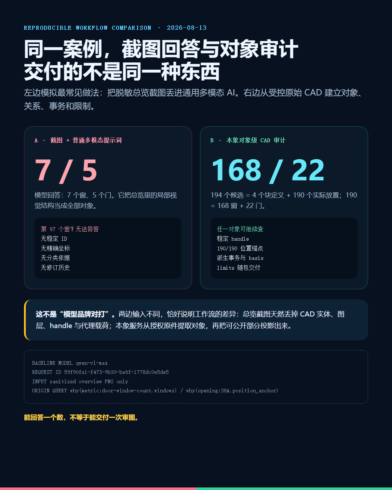
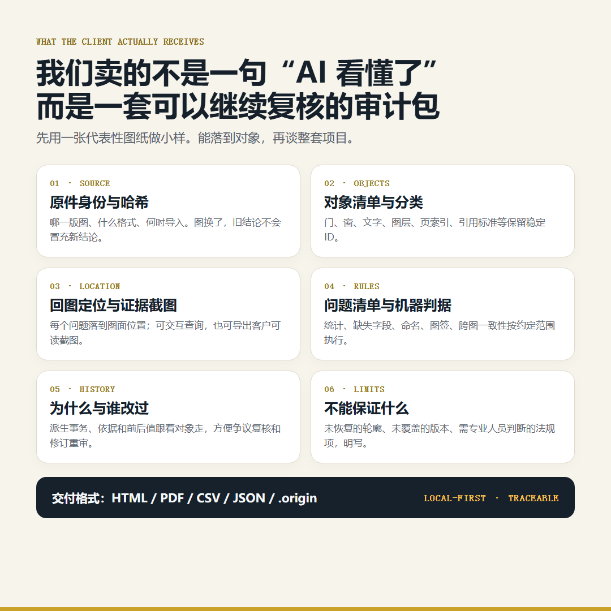
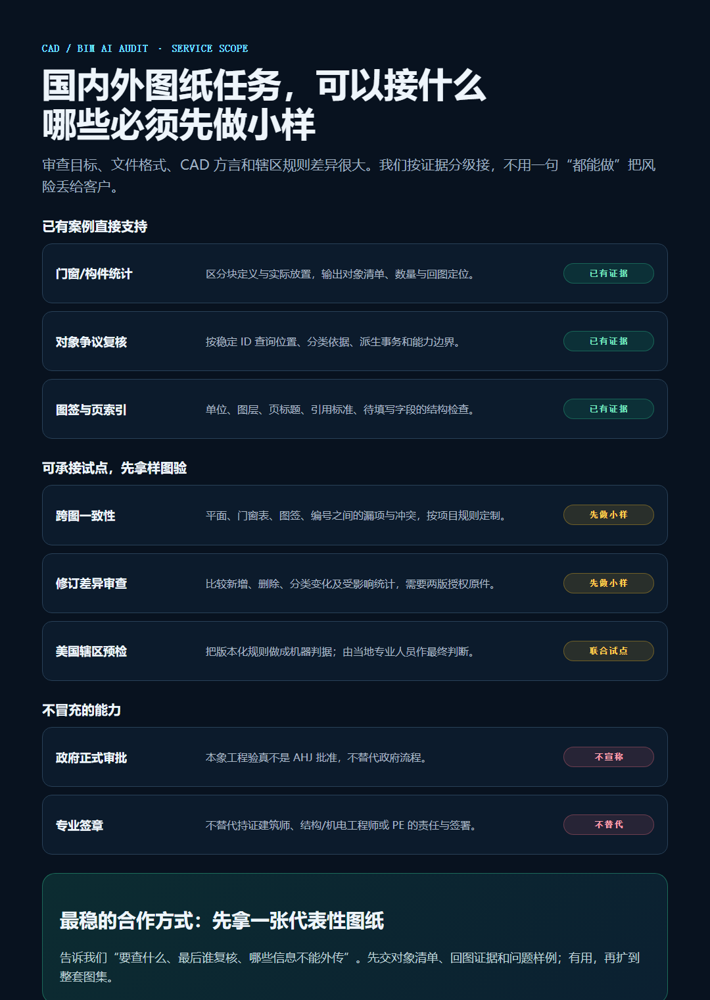

# 普通 AI 看图答 7 个窗，我们为什么敢接 CAD 图纸审计

> 同一份复杂 CAD，通用多模态 AI 只看脱敏总览截图，回答“7 个窗、5 个门”；对象级审计从受控原件得到 168 个窗、22 个门，并让 190 个实际对象逐个回图。差异不在谁更会聊天，而在客户最后拿到什么。

## 先看这次不太体面的实测

我把复杂 CAD 的脱敏总览图交给 `qwen-vl-max`，问题写得很普通：

> 图中实际放置的窗和门各有多少？第 97 个窗的稳定对象 ID、精确位置坐标和分类依据是什么？

模型回答：**7 个窗，5 个门。**

再问第 97 个窗，它明确说无法回答——截图里没有编号、属性标签、坐标系统，也没有原始 DWG/DXF 的实体属性。

这次运行不是编的。模型、提示词、token 用量和 request ID 都保存了：

```text
model       qwen-vl-max
request_id  59f90fa1-f473-9b30-ba6f-1778dc0e5de5
input       sanitized overview PNG only
answer      windows=7, doors=5
object #97  unavailable
```

我原来担心它会瞎编一个坐标。好在没有。它诚实承认：要拿对象 ID 和坐标，必须读取原始 CAD 实体。

==问题也正在这里。多数“AI 看懂 CAD”的演示，只给 AI 一张图。客户要的却不是一段看图感想，而是一份可以拿去复核的工程结果。==



先说清楚：这不是模型排行榜。两边输入本来就不同。

左边是最常见的聊天框工作流——截图加普通提示词。右边是 CAD 审计工作流——在客户授权环境里读取原件，恢复对象、关系和证据，再生成脱敏投影。

输入不同，不是实验瑕疵，恰好是我们要说的差异：%%总览截图在导出那一刻，已经丢掉了 handle、图层、代理载荷、块归属和大量几何信息。%%再强的模型，也不能稳定恢复一份从未给它的数据。

===

## 本象多做的，不是把 7 猜成 168

受控原始 DWG 里，离线流程找到了 `194` 个 `TCH_OPENING`：

```text
194 = 4 个块定义模板 + 190 个实际放置对象
190 = 168 个窗 + 22 个门 + 0 个未分类
```

如果只把结果写成 `windows=168`，其实和聊天框没拉开多少距离。数字看着更准，交付仍然很薄。

@@本象协议@@保留了 168 个窗和 22 个门背后的独立对象。每个对象有稳定 ID、所属关系、分类依据、载荷指纹和位置证据。190 个实际对象，`190/190` 恢复了位置锚点。


客户说“你可能多算了一樘”，我们不需要重新截屏问一次 AI。可以直接查：

```bash
origin why cases/cad-window-audit.origin \
  opening:38A.position_anchor
```

结果会返回坐标、写入者 `tch-opening-anchor-decoder`、事务 ID 和 basis。换句话说，系统不是知道“有 168 个”，而是知道这 168 个分别是谁。


这就是普通截图式 AI 和对象级审计的第一条硬差异：

> **截图式 AI 给答案；对象级审计交对象。答案可以复制，对象可以继续查。**

当然，当前案例也没把所有事做完。`limits.json` 明写着：168 的单位是窗樘/窗洞对象，不是玻璃片；GNU LibreDWG 独立确认的是候选总数 194，不是 168/22 分类；精确轮廓、朝向和 bbox 尚未恢复。

讲真，这几句对接单不算讨喜。但工程客户迟早会问。等出事再说，成本更高。

===

## 客户真正收到六样东西

很多 AI 项目交付完，只剩一份 PDF 和一段聊天记录。模型换了，会话清了，项目重新失忆。

我们的 CAD 审计包至少保留六类内容：

- 源文件身份、版本和 SHA-256；
- 对象清单、分类和稳定 ID；
- 回图位置与客户可读证据截图；
- 约定范围内的问题清单和机器判据；
- 派生历史：谁在什么时候凭什么写入；
- 能力边界：没恢复什么、哪些结论仍需专业人员判断。



交付可以是 HTML、PDF、CSV、JSON 和 `.origin`。人看报告，机器查对象，后续修订继续沿用同一套身份和证据。

&&这才是我们愿意承接 CAD AI 任务的原因：不是承诺第一次回答永远正确，而是把复核、纠错和重审做进交付物。&&

===

## 国外图纸也能做，但“美国审图”要拆开说

第二个案例来自 [City of San Diego 官方页面](https://www.sandiego.gov/development-services/forms-publications/design-guidelines-templates)的 `DS-3179 Construction Plan` DXF 模板。不是我们画的测试夹具。

导入结果：`187` 个对象、`319` 条关系、`10/10` 条机器约束可判定。系统识别了 `inch` 单位、9 个页索引、7 项引用标准，以及 `NAME OF COMPANY`、`SITE ADDRESS` 等待填写字段。


这里补一条更正。上一版验真页把 DXF 块参照画成了外接框，又把多行 CAD 文字按单行 SVG 排版，于是页面看上去只有重叠英文。源文件没有拿错，是可视投影器没把原图画完整。现在已经换成源 DXF 的 Model Space 直接渲染：完整图框、Sheet Index、施工变更表、Street Data Table 和官方图签都在。%%证据数据正确，不代表宣传截图就可以含糊；截图也必须接受验真。%%

这里的价值不是“AI 能读英文”。OCR 早就能读。

价值是每个 Sheet Index 条目、Governing Reference 和待填字段都保留源对象关系；一句“已读懂模板结构”的结论，可以反查它依据了哪些对象、由哪次事务产生。

所以，我们可以承接国内外这些任务：

- 门窗、设备、构件等对象统计与回图；
- 图层、命名、图签、页索引和缺失字段检查；
- 平面图、门窗表、编号和说明之间的一致性预检；
- 两版图纸的新增、删除、分类变化和影响范围审查；
- 美国或其他辖区的版本化规则预检，与当地专业人员联合复核；
- 客户要求的脱敏、本地处理和可追溯证据包。



但这句话必须钉住：!!本象工程验真不是 AHJ 批准，也不是建筑师或 PE 盖章。!! [ICC 模型规范](https://www.iccsafe.org/products-and-services/i-codes/the-i-codes/)要由州或地方辖区采纳，还可能有本地修订；专业签署受[NCEES 所说明的州级执照制度](https://ncees.org/licensure/)约束。

我们能做的是把预检问题、对象证据和规则版本整理清楚，让有责任的人更快复核。不能把责任偷偷甩给 AI。

===

## 哪类项目现在适合来找我们

最合适的，不是“帮我一键审完所有图”。这句话范围太大，通常连验收标准都没有。

更合适的是一个具体问题：

- 这套图里门窗到底有多少，分别在哪里？
- 门窗表与平面图是否一致，有没有漏编号或重复编号？
- 图签、单位、页索引、引用标准有没有缺项？
- 修订版改了哪些对象，哪些统计需要重算？
- 某个城市或业主的 CAD 标准，能否做成机器预检？
- 图纸不能外传，能不能在本地生成脱敏证据？

我更建议先拿一张代表性图纸做小样。告诉我们三个东西：**要查什么、最后由谁复核、哪些信息不能外传。**

我们先交一份小包：对象清单、回图截图、问题样例、规则口径和明确边界。能解决问题，再扩到整套图集。不能，就停在小样，不靠长合同掩盖技术风险。

这个流程不花哨，甚至有点保守。但审图本来就不该靠气氛组。

## 写在最后

普通 AI 和本象的区别，不是“我们用了一个更聪明的大模型”。今天的解析器、ODA、LibreDWG、大模型都在干活，本象没有必要抢它们的功劳。

真正的区别是：

> 普通截图式 AI 把 CAD 变成一次回答；本象把 CAD 变成一个可查询、可计算、可质疑、可复核的对象世界。

这次截图基线答错了数量，却正确指出自己拿不到对象 ID。反而把问题说透了。

**能看图，不等于能审图。能报数，不等于能交付。**

如果你手上有国内或海外 CAD/DXF 图纸，需要做统计、核对、规则预检或修订审查，可以先拿一张脱敏样图来测试。

### 联系与工具

- 微信：`hecare888`
- 邮箱：`hefangsheng@gmail.com`
- 作者团队的多 AI 安装与使用工具：++U-King++，可一键安装和使用 Claude Code、Codex、Hermes
- 工具入口：[u-king.org](https://u-king.org)
